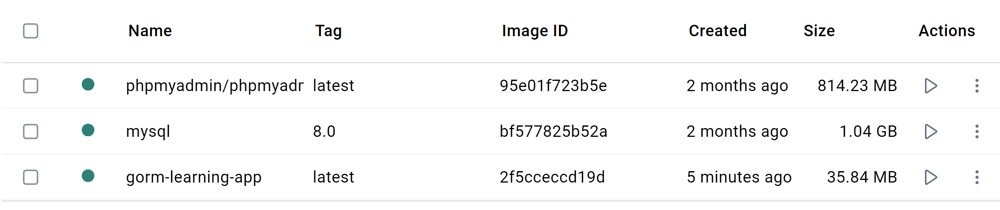
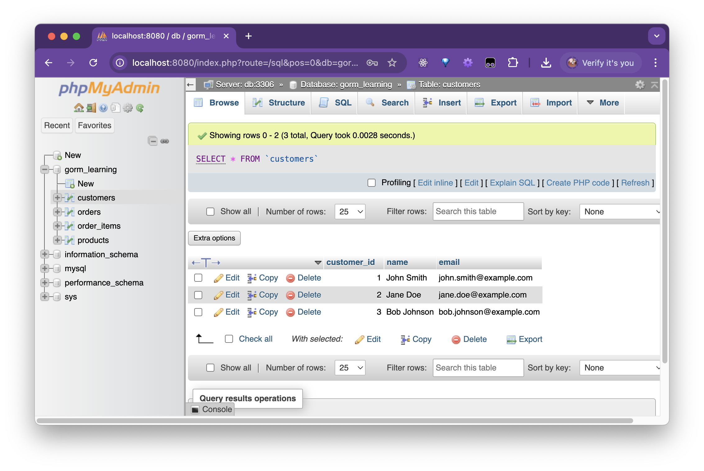
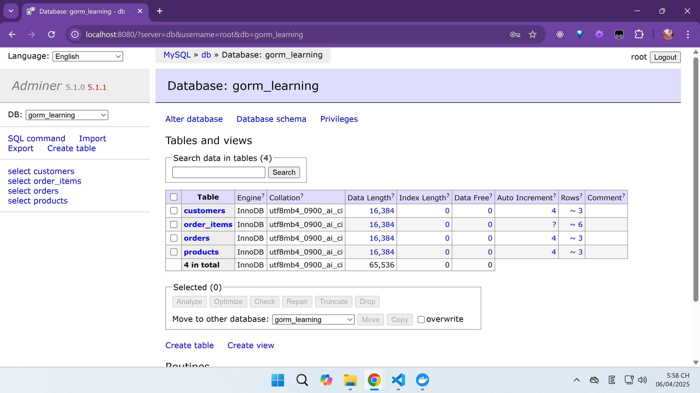
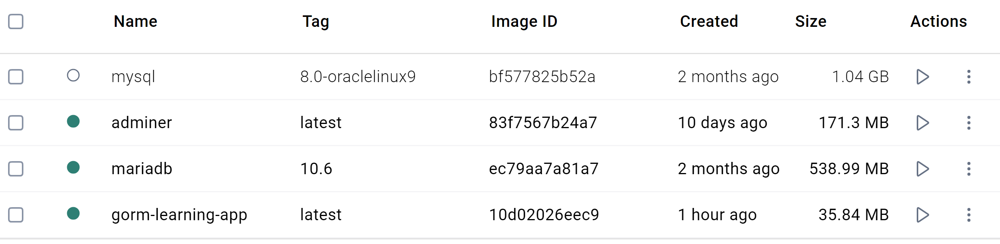

## project required structure
```
.
├── Dockerfile
├── docker-compose.yml
├── go.mod
├── go.sum
├── main.go
├── mysql/
│   └── init.sql
└── .env
```

## Running the application:
### Build and start the services:
```sh
docker compose up -d --build
```

View logs (or we can view logs of 2 services in Docker Desktop Container tab, but laggy as shit):
```sh
docker compose logs -f
```

Verify the network was created:
```sh
docker network ls
```

Stop the services:
```sh
# Stop and remove containers
docker compose down

# Remove all volumes (including persistent data, eg. mysql db)
docker volume prune

docker network prune
```

## To inspect the db container:
1. Exec into the db container
```sh
docker exec -it gorm-learning-db-1 bash
```
2. login to mysql
```sh
mysql -u root -p
```
Enter password: "rootpassword"
NOTE: And our database name is "gorm-learning"

**Quite heavy size for our services**


**They're even heavier size on Windows 11 Docker Desktop**



**Output, with a simple query**:
```sh
bash-5.1# mysql -u root -p
Enter password: 
Welcome to the MySQL monitor.  Commands end with ; or \g.
Your MySQL connection id is 88
Server version: 8.0.41 MySQL Community Server - GPL

Copyright (c) 2000, 2025, Oracle and/or its affiliates.

Oracle is a registered trademark of Oracle Corporation and/or its
affiliates. Other names may be trademarks of their respective
owners.

Type 'help;' or '\h' for help. Type '\c' to clear the current input statement.

mysql> USE gorm_learning
Reading table information for completion of table and column names
You can turn off this feature to get a quicker startup with -A

Database changed
mysql> SELECT * FROM customers;
Empty set (0.00 sec)

mysql> 
```
**TIPS:** in "mysql" -> type "quit" to exit mysql, then in bash -> Hit "Ctrl + D" to exit container terminal access

### or use phpmyadmin:
credentials:
- username: root
- password: rootpassword

**phpmyadmin Preview**


### Replace phpadmin/phpadmin since it's too heavy with adminer image, in docker-compose.yml:
```docker-compose.yml
phpmyadmin:
    # image: phpmyadmin/phpmyadmin  # (~570MB on macOS - ~814MB on Windows image)
    image: adminer  # Image size is 171.3MB on Windows
    restart: always
    ports:
      # - "8080:80" # "HOST_PORT:CONTAINER_PORT" (since phpmyadmin/phpmyadmin listens for internal port of 80)
      - "8080:8080"  # "HOST_PORT:CONTAINER_PORT" (since adminer listens for internal port of 8080)
    environment:
      - PMA_HOST=db
      - PMA_PORT=3306
      - MYSQL_ROOT_PASSWORD=rootpassword
    depends_on:
      - db
    networks:
      - app-network
```
Image size is 171.3MB on Windows
**php adminer Preview**



### Replace `mysql:8.0` with `mariadb:10.6` image to reduce image size
**docker-compose.yml**:
```docker-compose.yml
  db:
    # image: mysql:8.0  # (~764MB on macOS - ~1GB on Windows image)
    # image: mysql:8.0-oraclelinux9 # Also 1.04GB on Windows, same as the debian based "mysql:8.0" image
    # image: mysql/mysql-server:8.0 # failed, no permission
    image: mariadb:10.6 # 539MB on Windows
    command: --default-authentication-plugin=mysql_native_password
    environment:
      MYSQL_ROOT_PASSWORD: rootpassword
      MYSQL_USER: user
      MYSQL_PASSWORD: password
      MYSQL_DATABASE: gorm_learning
    volumes:
      - mysql-data:/var/lib/mysql
    healthcheck:
      test: ["CMD-SHELL", "mysqladmin ping -uroot -p$$MYSQL_ROOT_PASSWORD"]
      interval: 5s
      timeout: 10s
      retries: 20
      start_period: 30s
    networks:
      - app-network
```
**mariadb Image size**


### mysql MariaDB container error (exited)
LOGS:
```
2025-04-06 18:15:47 2025-04-06 11:15:47+00:00 [Note] [Entrypoint]: Entrypoint script for MariaDB Server 1:10.6.21+maria~ubu2004 started.
2025-04-06 18:15:48 2025-04-06 11:15:48+00:00 [Note] [Entrypoint]: Switching to dedicated user 'mysql'
2025-04-06 18:15:48 2025-04-06 11:15:48+00:00 [Note] [Entrypoint]: Entrypoint script for MariaDB Server 1:10.6.21+maria~ubu2004 started.
2025-04-06 18:15:49 2025-04-06 11:15:49+00:00 [Note] [Entrypoint]: MariaDB upgrade information missing, assuming required
2025-04-06 18:15:49 2025-04-06 11:15:49+00:00 [Note] [Entrypoint]: MariaDB upgrade (mariadb-upgrade or creating healthcheck users) required, but skipped due to $MARIADB_AUTO_UPGRADE setting
2025-04-06 18:15:49 2025-04-06 11:15:49 0 [Note] Starting MariaDB 10.6.21-MariaDB-ubu2004 source revision 066e8d6aeabc13242193780341e0f845528105de server_uid TSHkpl2IUYejLmMGEJlKxG3S+oE= as process 1
2025-04-06 18:15:49 2025-04-06 11:15:49 0 [Note] InnoDB: Compressed tables use zlib 1.2.11
2025-04-06 18:15:49 2025-04-06 11:15:49 0 [Note] InnoDB: Number of pools: 1
2025-04-06 18:15:49 2025-04-06 11:15:49 0 [Note] InnoDB: Using crc32 + pclmulqdq instructions
2025-04-06 18:15:49 2025-04-06 11:15:49 0 [Note] mariadbd: O_TMPFILE is not supported on /tmp (disabling future attempts)
2025-04-06 18:15:49 2025-04-06 11:15:49 0 [Note] InnoDB: Using Linux native AIO
2025-04-06 18:15:49 2025-04-06 11:15:49 0 [Note] InnoDB: Initializing buffer pool, total size = 134217728, chunk size = 134217728
2025-04-06 18:15:49 2025-04-06 11:15:49 0 [Note] InnoDB: Completed initialization of buffer pool
2025-04-06 18:15:49 2025-04-06 11:15:49 0 [ERROR] InnoDB: MySQL-8.0 tablespace in ./ibdata1
2025-04-06 18:15:49 2025-04-06 11:15:49 0 [ERROR] InnoDB: Restart in MySQL for migration/recovery.
2025-04-06 18:15:49 2025-04-06 11:15:49 0 [ERROR] InnoDB: Plugin initialization aborted with error Unsupported
2025-04-06 18:15:49 2025-04-06 11:15:49 0 [Note] InnoDB: Starting shutdown...
2025-04-06 18:15:49 2025-04-06 11:15:49 0 [ERROR] Plugin 'InnoDB' registration as a STORAGE ENGINE failed.
2025-04-06 18:15:49 2025-04-06 11:15:49 0 [Note] Plugin 'FEEDBACK' is disabled.
2025-04-06 18:15:49 2025-04-06 11:15:49 0 [ERROR] Could not open mysql.plugin table: "Table 'mysql.plugin' doesn't exist". Some plugins may be not loaded
2025-04-06 18:15:49 2025-04-06 11:15:49 0 [Warning] 'default-authentication-plugin' is MySQL 5.6 / 5.7 compatible option. To be implemented in later versions.
2025-04-06 18:15:49 2025-04-06 11:15:49 0 [ERROR] Unknown/unsupported storage engine: InnoDB
2025-04-06 18:15:49 2025-04-06 11:15:49 0 [ERROR] Aborting
```

Ahhh yeah, this one is a classic MySQL/MariaDB data dir mismatch! Let's walk through it so it clicks:

#### 🔥 What Just Happened?
You switched from MySQL → MariaDB but kept the same volume (mysql-data), and now MariaDB says:

```bash
MySQL-8.0 tablespace in ./ibdata1 → Unsupported
```

**Which means**:
MariaDB is seeing MySQL 8.0's data format.
It doesn't know how to deal with it and panics.
So it fails to initialize InnoDB and exits.

**💡 How to Fix It**
✅ Option 1: Nuke the Volume (for fresh DB)
```bash
docker volume rm gorm-learning_mysql-data
```
Then 
```sh
docker compose up
```
again.

This gives MariaDB a fresh data directory, no MySQL junk in there. This worked fine on Tuanhayho Windows 11 machine.

### testing the go webapi app:
**visit `http://localhost:3000/Customer`**:
Response:
```json
[
  {
    "CustomerId": 1,
    "Name": "John Smith",
    "Email": "john.smith@example.com",
    "Orders": null
  },
  {
    "CustomerId": 2,
    "Name": "Jane Doe",
    "Email": "jane.doe@example.com",
    "Orders": null
  },
  {
    "CustomerId": 3,
    "Name": "Bob Johnson",
    "Email": "bob.johnson@example.com",
    "Orders": null
  }
]
```

**visit `http://localhost:3000/Product`**:
Response:
```json
[
  {
    "ProductId": 1,
    "name": "Product 1",
    "price": 9.99
  },
  {
    "ProductId": 2,
    "name": "Product 2",
    "price": 14.99
  },
  {
    "ProductId": 3,
    "name": "Product 3",
    "price": 19.99
  }
]
```

**visit `http://localhost:3000/orders-miss-product`**:
Response:
```json
[
  {
    "OrderId": 2,
    "OrderDate": "2025-04-05T23:41:32Z",
    "CustomerId": 2,
    "Customer": {
      "CustomerId": 2,
      "Name": "Jane Doe",
      "Email": "jane.doe@example.com"
    },
    "OrderItems": [
      {
        "OrderItemId": 4,
        "ProductId": 3,
        "Quantity": 1,
        "Product": {
          "ProductId": 0,
          "Name": "",
          "Price": 0
        }
      },
      {
        "OrderItemId": 3,
        "ProductId": 1,
        "Quantity": 3,
        "Product": {
          "ProductId": 0,
          "Name": "",
          "Price": 0
        }
      }
    ],
    "Total": 0
  },
  {
    "OrderId": 3,
    "OrderDate": "2025-04-05T23:41:32Z",
    "CustomerId": 3,
    "Customer": {
      "CustomerId": 3,
      "Name": "Bob Johnson",
      "Email": "bob.johnson@example.com"
    },
    "OrderItems": [
      {
        "OrderItemId": 6,
        "ProductId": 3,
        "Quantity": 2,
        "Product": {
          "ProductId": 0,
          "Name": "",
          "Price": 0
        }
      },
      {
        "OrderItemId": 5,
        "ProductId": 2,
        "Quantity": 2,
        "Product": {
          "ProductId": 0,
          "Name": "",
          "Price": 0
        }
      }
    ],
    "Total": 0
  },
  {
    "OrderId": 1,
    "OrderDate": "2025-04-05T23:41:32Z",
    "CustomerId": 1,
    "Customer": {
      "CustomerId": 1,
      "Name": "John Smith",
      "Email": "john.smith@example.com"
    },
    "OrderItems": [
      {
        "OrderItemId": 2,
        "ProductId": 2,
        "Quantity": 1,
        "Product": {
          "ProductId": 0,
          "Name": "",
          "Price": 0
        }
      },
      {
        "OrderItemId": 1,
        "ProductId": 1,
        "Quantity": 2,
        "Product": {
          "ProductId": 0,
          "Name": "",
          "Price": 0
        }
      }
    ],
    "Total": 0
  }
]
```
**visit `http://localhost:3000/orders-worked`**:
Response:
```json
[
  {
    "OrderId": 1,
    "OrderDate": "2025-04-05T23:41:32Z",
    "CustomerId": 1,
    "Customer": {
      "CustomerId": 1,
      "Name": "John Smith",
      "Email": "john.smith@example.com"
    },
    "OrderItems": [
      {
        "OrderItemId": 2,
        "ProductId": 2,
        "Quantity": 1,
        "Product": {
          "ProductId": 2,
          "Name": "Product 2",
          "Price": 14.99
        }
      },
      {
        "OrderItemId": 1,
        "ProductId": 1,
        "Quantity": 2,
        "Product": {
          "ProductId": 1,
          "Name": "Product 1",
          "Price": 9.99
        }
      }
    ],
    "Total": 34.97
  },
  {
    "OrderId": 2,
    "OrderDate": "2025-04-05T23:41:32Z",
    "CustomerId": 2,
    "Customer": {
      "CustomerId": 2,
      "Name": "Jane Doe",
      "Email": "jane.doe@example.com"
    },
    "OrderItems": [
      {
        "OrderItemId": 4,
        "ProductId": 3,
        "Quantity": 1,
        "Product": {
          "ProductId": 3,
          "Name": "Product 3",
          "Price": 19.99
        }
      },
      {
        "OrderItemId": 3,
        "ProductId": 1,
        "Quantity": 3,
        "Product": {
          "ProductId": 1,
          "Name": "Product 1",
          "Price": 9.99
        }
      }
    ],
    "Total": 49.96
  },
  {
    "OrderId": 3,
    "OrderDate": "2025-04-05T23:41:32Z",
    "CustomerId": 3,
    "Customer": {
      "CustomerId": 3,
      "Name": "Bob Johnson",
      "Email": "bob.johnson@example.com"
    },
    "OrderItems": [
      {
        "OrderItemId": 6,
        "ProductId": 3,
        "Quantity": 2,
        "Product": {
          "ProductId": 3,
          "Name": "Product 3",
          "Price": 19.99
        }
      },
      {
        "OrderItemId": 5,
        "ProductId": 2,
        "Quantity": 2,
        "Product": {
          "ProductId": 2,
          "Name": "Product 2",
          "Price": 14.99
        }
      }
    ],
    "Total": 69.96
  }
]
```

**visit `http://localhost:3000/orders-not-grouped`**:
Response:
```json
[
  {
    "OrderId": 1,
    "OrderDate": "2025-04-05T23:41:32Z",
    "CustomerId": 1,
    "Customer": {
      "CustomerId": 1,
      "Name": "John Smith",
      "Email": "john.smith@example.com"
    },
    "OrderItems": [
      {
        "OrderItemId": 2,
        "ProductId": 2,
        "Quantity": 1,
        "Product": {
          "ProductId": 2,
          "Name": "Product 2",
          "Price": 14.99
        }
      }
    ],
    "Total": 14.99
  },
  {
    "OrderId": 1,
    "OrderDate": "2025-04-05T23:41:32Z",
    "CustomerId": 1,
    "Customer": {
      "CustomerId": 1,
      "Name": "John Smith",
      "Email": "john.smith@example.com"
    },
    "OrderItems": [
      {
        "OrderItemId": 1,
        "ProductId": 1,
        "Quantity": 2,
        "Product": {
          "ProductId": 1,
          "Name": "Product 1",
          "Price": 9.99
        }
      }
    ],
    "Total": 19.98
  },
  {
    "OrderId": 2,
    "OrderDate": "2025-04-05T23:41:32Z",
    "CustomerId": 2,
    "Customer": {
      "CustomerId": 2,
      "Name": "Jane Doe",
      "Email": "jane.doe@example.com"
    },
    "OrderItems": [
      {
        "OrderItemId": 4,
        "ProductId": 3,
        "Quantity": 1,
        "Product": {
          "ProductId": 3,
          "Name": "Product 3",
          "Price": 19.99
        }
      }
    ],
    "Total": 19.99
  },
  {
    "OrderId": 2,
    "OrderDate": "2025-04-05T23:41:32Z",
    "CustomerId": 2,
    "Customer": {
      "CustomerId": 2,
      "Name": "Jane Doe",
      "Email": "jane.doe@example.com"
    },
    "OrderItems": [
      {
        "OrderItemId": 3,
        "ProductId": 1,
        "Quantity": 3,
        "Product": {
          "ProductId": 1,
          "Name": "Product 1",
          "Price": 9.99
        }
      }
    ],
    "Total": 29.97
  },
  {
    "OrderId": 3,
    "OrderDate": "2025-04-05T23:41:32Z",
    "CustomerId": 3,
    "Customer": {
      "CustomerId": 3,
      "Name": "Bob Johnson",
      "Email": "bob.johnson@example.com"
    },
    "OrderItems": [
      {
        "OrderItemId": 6,
        "ProductId": 3,
        "Quantity": 2,
        "Product": {
          "ProductId": 3,
          "Name": "Product 3",
          "Price": 19.99
        }
      }
    ],
    "Total": 39.98
  },
  {
    "OrderId": 3,
    "OrderDate": "2025-04-05T23:41:32Z",
    "CustomerId": 3,
    "Customer": {
      "CustomerId": 3,
      "Name": "Bob Johnson",
      "Email": "bob.johnson@example.com"
    },
    "OrderItems": [
      {
        "OrderItemId": 5,
        "ProductId": 2,
        "Quantity": 2,
        "Product": {
          "ProductId": 2,
          "Name": "Product 2",
          "Price": 14.99
        }
      }
    ],
    "Total": 29.98
  }
]
```

**visit `http://localhost:3000/orders-raw-not-grouped`**:
Response:
```
error parsing order date: parsing time "2025-04-05 23:41:32" as "2006-01-02 15:04:05.000": cannot parse "" as ".000"
```

**visit `http://localhost:3000/orders-simple-orm-anonymous`**:
Response:
```json
[
  {
    "orderId": 1,
    "orderDate": "2025-04-05T23:41:32Z",
    "customerId": 1
  },
  {
    "orderId": 2,
    "orderDate": "2025-04-05T23:41:32Z",
    "customerId": 2
  },
  {
    "orderId": 3,
    "orderDate": "2025-04-05T23:41:32Z",
    "customerId": 3
  }
]
```


## Achtung Docker eating mac's drive a lot !!!
```sh
TuanhayhoMacBookPro:~ user$ docker system df
TYPE            TOTAL     ACTIVE    SIZE      RECLAIMABLE
Images          13        5         5.259GB   2.6GB (49%)
Containers      5         0         146.3MB   146.3MB (100%)
Local Volumes   4         2         293.9MB   245.5MB (83%)
Build Cache     408       0         19.01GB   19.01GB
TuanhayhoMacBookPro:~ user$ 
```
**=> nearly 20GB is eaten up for Build Cache**

Let's free up that space and reclaim some of the `19GB`!

1. Clean Up Build Cache:
Docker keeps a `build cache` to speed up future builds. However, it can grow unchecked over time. You can clean up this cache using:

```bash
docker builder prune --all --force
```
This command will remove all unused build cache, including intermediate images, to free up space. The `--force` flag bypasses the confirmation prompt.

Result (logs)
```sh
TuanhayhoMacBookPro:gorm-learning user$ docker builder prune --all --force
ID                                              RECLAIMABLE     SIZE            LAST ACCESSED
mw534m2j5s5750fc79rwia7fk                       true            66B             8 hours ago
xe5kpkzct43cv4fwcczrrnqs3*                      true    115.5MB         7 hours ago
p41ptteyvj45vv59k6nyosmfc*                      true    0B              2 weeks ago
s0gs24k1veymbbheyyxostq8r*                      true    16.5kB          3 days ago
cxaubhe5g1jg6oiiizgkafbik                       true    27.43kB         4 weeks ago
wwpxch61eh37cbwuik8v0o2dn                       true    66B             7 hours ago
z0joohfs48gd3e92mo3eg0k1y*                      true    115.5MB         About an hour ago
o4ocjw7avuolgzy3kmyk684v1                       true    66B             6 hours ago
xzexirrlx45qy5jg99yprye47                       true    4.197MB         2 weeks ago
hxkhbxdeont5n18op0wbn6nc3                       true    0B              About an hour ago
t2tpqqp7vayhyzby61ohm0svy*                      true    388.1MB         2 weeks ago
ii5m88296a4alyysez4tdg3ah                       true    5.526kB         4 weeks ago
euwgg1tfpw00imvyh9i4llqdv*                      true    10.62kB         4 weeks ago
ldymlpnlcaoeeijhjg36s5pls                       true    13.97MB         4 seconds ago
ofvmro61hz3gikraj1dyad1kj*                      true    115.4MB         7 hours ago
yqyj9ggsavxxpim6ozpr23kzq                       true    25.18kB         About an hour ago
w6tp1btjtkyoio8cx0lkwuf8f*                      true    4.807kB         4 weeks ago
ehl2yhtr1nl10iq9ilbrl5mga                       true    14.17MB         5 weeks ago
rkq1uusvympuj1cu2cadkdxf8*                      true    115.5MB         7 hours ago
rnh2a3ilbdnngjioacy4dipvk*                      true    0B              4 weeks ago
wkuhliia3j1mmg3rwhwd4ix6x                       true    1.524kB         4 weeks ago
1nvtecyvy7lxm889rgdw1fyjf                       true    66B             8 hours ago
. . . (thounsands of lines) . . . 
unxribsu1rnj6dek829wn5hgi                       true    20.75kB         10 seconds ago
2yq9umiqbnk3zk8svtyc1pqrz                       true    32.41MB         2 weeks ago
78qxkhtpo3jszs5k8sxti4fp7                       true    5.526kB         14 seconds ago
rqm1b0w5ityuy8lm7x4o16fs2                       true    304.2MB         22 seconds ago
p3yfs94ljxlnkgwb5kmq4sz6p*                      true    1.355kB         About an hour ago
jbdj18ytv3ydcb04j0img53ek*                      true    0B              4 weeks ago
4ep3n6qbys90nbjz6u8lwsgyckv                       true    304.2MB         4 seconds ago

Total:  19.02GB
```

2. Remove Stopped Containers:
The output shows you have 5 containers, with 146MB of space used. If you have any stopped containers, they are taking up space unnecessarily. You can remove them using:

```bash
docker container prune --force
```
This will remove all stopped containers.

3. Remove Unused Volumes:
Docker volumes can also accumulate and consume space. You have 4 volumes, with 293.9MB used. To remove unused volumes, use:

```bash
docker volume prune --force
```
This will clean up any unused volumes, freeing up space.

4. Regular Cleanup: Consider adding periodic cleanup for unused containers, volumes, and images:

```bash
docker system prune --all --volumes --force
```